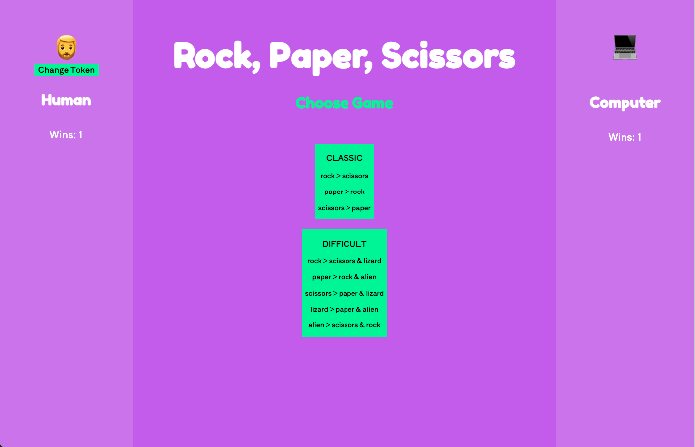
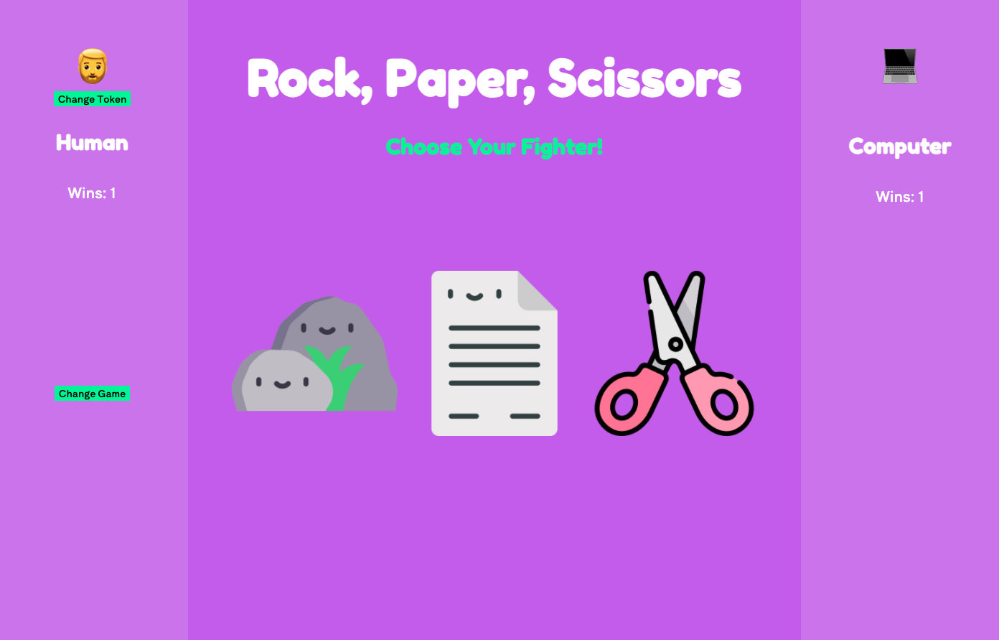
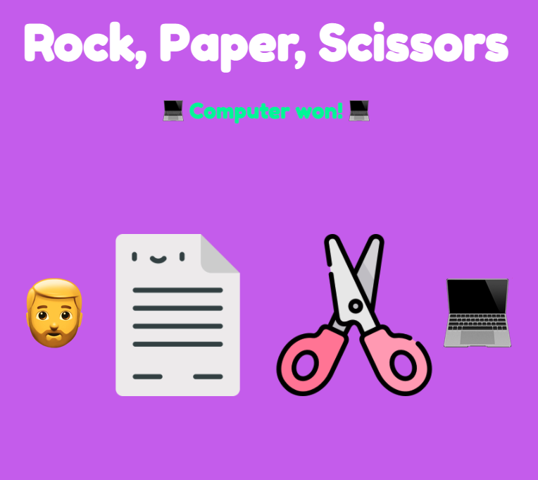
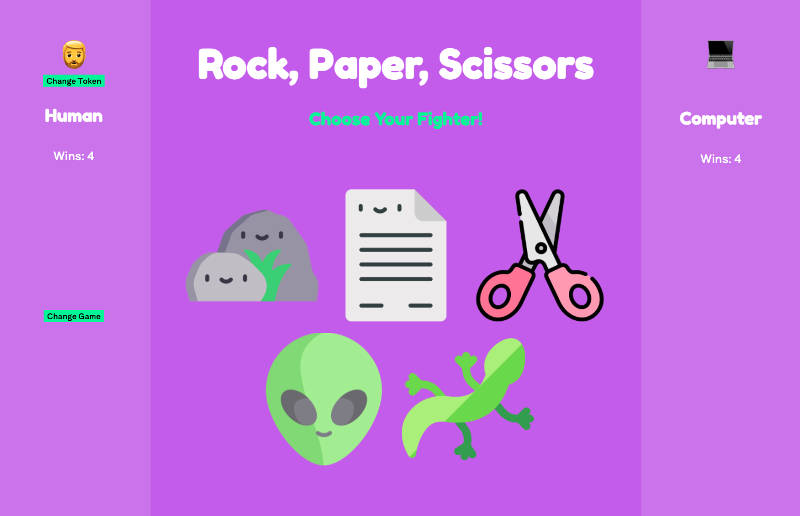

# **Rock Paper Scissors**
This web app allows users to play the game of rock, paper, scissors. This project was a learning assignment for the Front End Development program at Turing School of Software and Design. The author of this web app had approximately 5 weeks of experience using Javascript, HTML and CSS.

!(Rock, paper, scissors giphy)[https://media.giphy.com/media/JQAXhJMw2WbKWYjn8g/giphy.gif]

## Author
[Rachel Hill](https://github.com/rachellhill)

## Technologies Used
- github
- HTML
- Javascript
- css

## Local Setup Instructions
- Fork this repo to create your own copy.
- Clone your newly-forked repo. Make sure SSH is selected.
- Type `cd rock-paper-scissors` to move into the root directory.
- Run `open index.html` to view and navigate this app in the browser.

## User Instructions
- When the browser loads, a user is able to change their token (or emoji) at the top left corner.

- A user has two options to select in order to play rock, paper, scissors.
  - Select either 'classic' or 'difficult' to play the game.
- Once a user clicks on their desired game, a set of icons will appear in which a user can click to start at any time and the user's pick will be checked against the computer's automatic choice each time a user clicks their fighter.

- If you win, you will see your token pop up at the top and say "Human won!" and points added to your score on the left. If you lose, the computer wins and they receive points. If it's a draw, no one receives any points.

- A user can change the game at any point by clicking the button `change game` and their points will still be there to keep playing.
  - Please note: refreshing the page will lose your score and erase your points.

## Code Architecture

This project consists of 5 primary files: player.js, game.js, main.js, index.html, styles.css and ancillary files containing images.

- player.js and game.js are the two class files that interact with the data model.
- main.js houses all Javascript functionality.

# For Instructors:

Project spec and rubring can be found [HERE](https://frontend.turing.edu/projects/module-1/rock-paper-scissors-solo.html).
